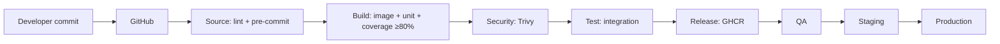

# Modern CI/CD Pipeline Demo

[](https://github.com/ovalles2019/cicd-pipeline-demo/actions/workflows/cicd.yml)
[](LICENSE)
[](https://www.python.org/downloads/)
[](pyproject.toml)

Learn and showcase a production-style CI/CD pipeline: commit → lint → build → test → registry → QA → Staging → Production.

A tiny FastAPI app is the *artifact*. The real product is the pipeline around it.



## Pipeline stages (map to the diagram)

| Diagram stage | What runs here | Job name |
|---------------|----------------|----------|
| **Source** | Branch protection + Ruff + optional pre-commit | `lint` |
| **Build** | Docker image + unit tests + **coverage gate 80%** | `build-image`, `unit-tests`, `coverage` |
| **Security** | Trivy image scan (CRITICAL/HIGH) | `security-scan` |
| **Test** | Integration tests | `integration-tests` |
| **Release** | Push image to **GHCR** | `release` |
| **Deploy** | Promote **QA → Staging → Production** | `deploy-qa`, `deploy-staging`, `deploy-production` |

On pull requests, Source → Build → Security → Test run (no release/deploy).
On `main`, the full path runs. Staging and Production wait for **manual approval** via GitHub Environments.

## Quick start (local)

```bash
python3 -m venv .venv
source .venv/bin/activate
pip install -r requirements-dev.txt
pip install pre-commit && pre-commit install   # local commit checks

# quality gates (same checks CI runs)
ruff check app tests
ruff format --check app tests
pytest tests/unit --cov=app --cov-fail-under=80
pytest tests/integration -v

# run the API
uvicorn app.main:app --reload --port 8000
# → http://127.0.0.1:8000/health
# → http://127.0.0.1:8000/docs
```

## Repo layout

```text
app/                  # FastAPI service (the deployable)
tests/unit/           # Build-stage unit tests
tests/integration/    # Test-stage integration flows
.github/workflows/    # CI/CD pipeline definition
.github/dependabot.yml
.pre-commit-config.yaml
docs/                 # Branch protection + deploy wiring
Dockerfile            # Container image (build + Trivy scan)
render.yaml           # QA / Staging / Production on Render
```

## GitHub setup (show-ready)

1. Branch protection on `main` — require the checks in [`docs/branch-protection.md`](docs/branch-protection.md).
2. Environments `qa`, `staging`, `production` — reviewers on staging + production ([`docs/deploy.md`](docs/deploy.md)).
3. Wire Render (Deploy Hooks or `RENDER_API_KEY` + service ID vars).

Without Render credentials, deploy jobs still *simulate* promotion so the Actions graph stays learnable.

## What this demonstrates on a resume / portfolio

- Quality gates that **fail the pipeline** (lint, coverage, Trivy)
- Local commit checks via pre-commit (same lint as CI)
- Build once, promote through environments with human approval
- Container registry as the release boundary (GHCR)
- Dependabot for pip + GitHub Actions
- Infrastructure-as-code for target envs (`render.yaml`)

## API surface

| Method | Path | Purpose |
|--------|------|---------|
| `GET` | `/health` | Liveness + environment + version |
| `GET` | `/version` | App metadata |
| `GET/POST` | `/api/items` | Tiny CRUD used by tests |

## License

MIT — use freely for learning and portfolio demos.
